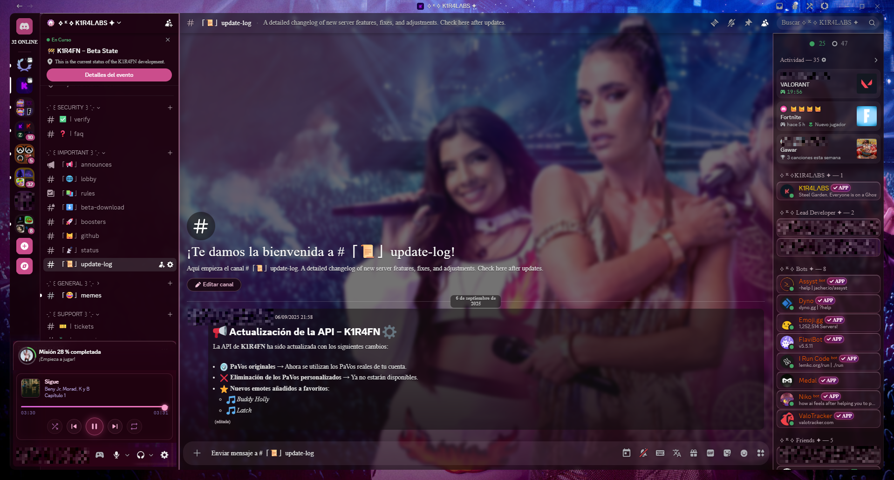

# La Reina del Flow



A dark glass Discord theme with pink accents, liquid glass effects, and a dreamy aesthetic. Optimized for **Vencord**, also compatible with **BetterDiscord**.

---

## Install on BetterDiscord

1. Download [LRDF.theme.css](https://raw.githubusercontent.com/Kira-Kohler/discord-themes/main/La-Reina-del-Flow/LRDF.theme.css)
2. Move it to your BetterDiscord themes folder:
   - **Windows:** `%AppData%\BetterDiscord\themes\`
   - **macOS:** `~/Library/Application Support/BetterDiscord/themes/`
   - **Linux:** `~/.config/BetterDiscord/themes/`
3. Open Discord → **Settings → BetterDiscord → Themes** and enable **La Reina del Flow**

---

## Install on Vencord

**Option 1 — Online Themes (recommended, no files needed)**

1. Open Discord → **Settings → Vencord → Themes → Online Themes**
2. Paste this URL and close Settings:
   ```
   https://raw.githubusercontent.com/Kira-Kohler/discord-themes/main/La-Reina-del-Flow/LRDF.theme.css
   ```

**Option 2 — Local file**

1. Download [LRDF.theme.css](https://raw.githubusercontent.com/Kira-Kohler/discord-themes/main/La-Reina-del-Flow/LRDF.theme.css)
2. Move it to `%AppData%\Vencord\themes\`
3. Open Discord → **Settings → Vencord → Themes** and enable **La Reina del Flow**

---

## Features

- Liquid glass panels with `backdrop-filter` blur and saturation
- Pink-dark color palette with gradient accents
- Styled quest/orbs tab, bot buttons, profile modals, Spotify RPC card
- Custom reactions, mentions, thread cards, invite embeds
- Hidden scrollbars for a clean sidebar
- Plugin support: SpotifyControls, QuestCompleter, CustomIdle, ReviewDB, SyntaxHighlight, MemberCount

---

Made by [Kira Kohler](https://kirakohler.es)
